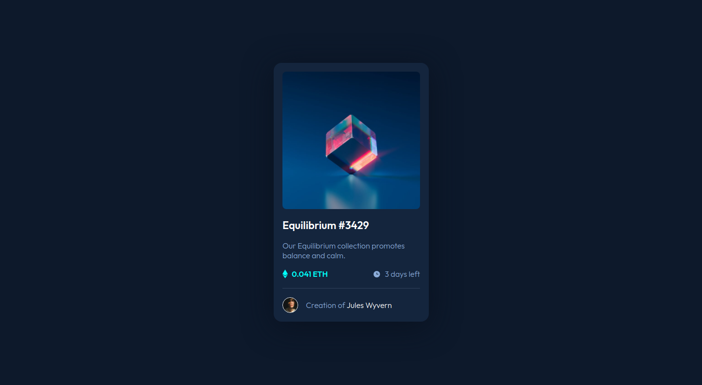

# Frontend Mentor - NFT preview card component solution

This is a solution to the [NFT preview card component challenge on Frontend Mentor](https://www.frontendmentor.io/challenges/nft-preview-card-component-SbdUL_w0U). Frontend Mentor challenges help you improve your coding skills by building realistic projects. 

## Table of contents

- [Overview](#overview)
  - [The challenge](#the-challenge)
  - [Screenshot](#screenshot)
  - [Links](#links)
- [My process](#my-process)
  - [Built with](#built-with)
  - [What I learned](#what-i-learned)
  - [Continued development](#continued-development)
  - [Useful resources](#useful-resources)
- [Author](#author)
- [Acknowledgments](#acknowledgments)

## Overview

### The challenge

Users should be able to:

- View the optimal layout depending on their device's screen size
- See hover states for interactive elements

### Screenshot



### Links

- Solution URL: [Github Repo](https://github.com/gian-noche/frontend-mentor-nft-preview-card)
- Live Site URL: [Github Pages](https://gian-noche.github.io/frontend-mentor-nft-preview-card/)

## My process

### Built with

- Semantic HTML5 markup
- CSS custom properties
- Flexbox
- Mobile-first workflow

### What I learned

Most of this challenge is a recap of the preview ones, particularly with the mobile layout using flexbox.

The main obstacle for me on this one was the hover state.

- First barrier was centering the svg view icon on the hero image. Here I revisited the position absolute, taking the element off of the normal flow.

```css
.image {
    position: relative;
}

.icon-view,
.overlay {
    position: absolute;
    transform: translate(-50%,-50%);
    top: 50%;
    left: 50%;

    opacity: 0;
}

.icon-view {
    z-index: 3;
}
```
- Next was figuring out how to reveal an element whilst hovering on another. In this case, the view icon and the transparent cyan background showing up as you hover over the image.

```css
.image:hover .icon-view {
    opacity: 1;
}

.image:hover .overlay {
    opacity: 0.5;
}
```

This is also the first time I used <hr> for these challenges so that's an added bonus.

### Continued development

I'm hoping to be able to understand position even better next time to the point where I'm aware of how the elements are behaving. For this challenge I kinda knew I had to set the image as the container for the view icon by setting it to relative but I'm not entirely sure why.

### Useful resources

- [MDN](https://developer.mozilla.org/)
- [Stackoverflow](https://stackoverflow.com/)
- [CSS-tricks](https://css-tricks.com/)

## Author

- Github - [pewpewhamster(gian-noche)](https://github.com/gian-noche)
- Linkedin - [Gian Levi Noche](https://www.linkedin.com/in/giannoche/)
- Frontend Mentor - [@gian-noche](https://www.frontendmentor.io/profile/gian-noche)
- Instagram - [@pewpewhamster](https://www.instagram.com/pewpewhamster/)

## Acknowledgments

Thank you **Frontend Mentor** for this challenge!